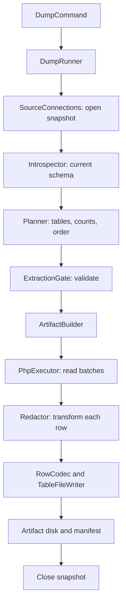

# Dead Drop: a walkthrough of the code

This describes the implementation merged in `18fdae3`. Read it from top to bottom
for the complete path from a Laravel database to a redacted artifact and back.
Links point to the classes that own each step.

## 1. What the package does today

Dead Drop runs inside a Laravel application. It discovers a database schema,
writes a reviewable configuration, exports selected tables with redaction, and
loads an artifact into an existing local or staging schema.

The public dump command exports whole tables from the selected connection.
`data` tables are included; `skip` tables are excluded. There is
also an internal engine for selecting related rows starting from a root, but
that engine does not have a public dump command yet.

A dump contains data and metadata needed to read it. It does not create the
target schema, run migrations, or produce a native SQL backup.

The command entry points are:

| Command | Entry point | Responsibility |
| --- | --- | --- |
| `dead-drop:init` | [InitCommand](../src/Console/Commands/InitCommand.php) | Discover schema and generate/update reviewed config |
| `dead-drop:check` | [CheckCommand](../src/Console/Commands/CheckCommand.php) | Find schema drift and invalid redaction decisions |
| `dead-drop:dump` | [DumpCommand](../src/Console/Commands/DumpCommand.php) | Plan, export, or enqueue a dump |
| `dead-drop:dumps` | [DumpsCommand](../src/Console/Commands/DumpsCommand.php) | Read manifests and list artifact status |
| `dead-drop:pull` | [PullCommand](../src/Console/Commands/PullCommand.php) | Confirm and run a load into a target connection |

## 2. Laravel boots the package

[composer.json](../composer.json) declares `DeadDropServiceProvider` for Laravel
package discovery. The [provider](../src/DeadDropServiceProvider.php) merges
[config/dead-drop.php](../config/dead-drop.php), registers services, and registers
the Artisan commands when running in the console.

Most classes use constructor injection and need no explicit binding. A few
bindings control shared state:

| Binding | Lifetime | Why it matters |
| --- | --- | --- |
| `SourceConnections` | Singleton | Planning and export must resolve the same active snapshot connection |
| `ExecutorManager` | Singleton | Holds executor registrations and resolved executor instances |
| `LoaderRegistry` | Singleton | Resolves an artifact format to its loader; NDJSON is installed by default |
| `RedactionContext` | Scoped | Shares salt and cached replacement password hashes within one job/request |
| `KeySetRepository` | Scoped | Owns temporary key tables used by scoped traversal |

`RedactionContext` derives its salt from `APP_KEY` unless an explicit redaction
salt is configured. Its scoped lifetime lets Laravel queue workers reset that
context between jobs. `SourceConnections` instead clears its active snapshot
map explicitly in `finally` after each dump.

There are two different kinds of configuration. The package config controls
storage, queue routing, redaction defaults, and allowed pull environments. Files
such as the application's `config/dead-drop/mysql.php` describe individual
tables and the decisions made about them. Laravel's own `database.connections`
still owns database credentials.

## 3. Discovering and reviewing the database

For `dead-drop:init --connection=mysql`, `InitCommand::handle()` first calls
[Introspector::inspect()](../src/Schema/Introspector.php). This reads tables,
columns, indexes, foreign keys, and estimated sizes through Laravel's schema
builder and the package's [database drivers](../src/Drivers/DriverFactory.php).

The result is a `DatabaseSchema` containing `Table`, `Column`, `Index`, and
`ForeignKey` objects. These objects describe what exists in the database. They
do not contain the table's application rows.

[EdgeInferrer](../src/Inference/EdgeInferrer.php) then discovers relationships.
Declared foreign keys take precedence over Eloquent relationships, which take
precedence over naming guesses. A discovered relationship becomes a reference
in the generated config, with its source recorded.

[TableClassifier](../src/Inference/TableClassifier.php) skips known framework
tables such as `jobs`, `sessions`, and `cache`. Every other table becomes
`data`. These are starting decisions to review.

The sensitive-column detector proposes redaction rules. Ambiguous fields can
receive `review`, which must be replaced with an explicit decision before an
export will pass validation. Inference is based on schema information and
conventions; it does not inspect every stored value to discover sensitive data.

[ConfigRenderer](../src/Config/ConfigRenderer.php) writes the PHP configuration.
On a later `init`, [ConfigMerger](../src/Config/ConfigMerger.php) preserves existing
classification and redaction decisions while incorporating discovered columns
and new entries. Tables that disappeared are marked `removed`.

[ConfigLoader](../src/Config/ConfigLoader.php) reads those files back into a
`ConfigSet`, containing a `ConnectionConfig` per connection and a `TableConfig`
per table. This is the reviewed policy that the rest of the package uses.

`dead-drop:check` compares that policy to fresh schema metadata through
[DriftDetector](../src/Config/DriftDetector.php) and validates redaction rules.
New or removed schema elements can therefore make a previously reviewed config
fail the check. The dump repeats its own gate checks before exporting rows.

## 4. Following a foreground dump

Consider this command after the config has been generated and reviewed:

```bash
php artisan dead-drop:dump --connection=mysql --no-interaction
```

`DumpCommand::handle()` loads configuration, selects the connection, and creates
a `Root::full('mysql')`. A full root describes whole-connection scope; it is not
a row ID. The command then delegates the work to
[DumpRunner::run()](../src/Extraction/DumpRunner.php).



The runner owns the complete operation: snapshot lifetime, introspection,
planning, validation, and artifact construction. The command owns arguments,
terminal prompts, progress display, and exit status. Queue jobs reuse the same
runner, so there is one export implementation.

The runner currently introspects and validates all connections loaded from the
config directory, even when the plan exports just one selected connection.
A problem in another loaded config can therefore block the dump.

With `--dry-run`, the runner still builds the plan and checks the gate, but
returns without building an artifact. In a real interactive terminal, the
command can also prompt for planning versus extraction. `--no-interaction`
makes the foreground command proceed without that prompt.

## 5. Exactly how the MySQL snapshot works

[SourceConnections::snapshot()](../src/Extraction/SourceConnections.php) wraps
the runner's work. For each selected MySQL/MariaDB connection, it obtains the
resolved writer settings and creates a private Laravel database connection.
It does not replace the application's registered connection.

Before starting, it checks that configured, included tables use InnoDB. It then
executes:

```sql
SET TRANSACTION ISOLATION LEVEL REPEATABLE READ, READ ONLY;
```

It starts a transaction through Laravel. The first consistent application-table
read establishes the snapshot; in the normal full-dump path, this occurs during
planning counts. Subsequent counts and exports on that connection share it.

`Introspector`, `Planner`, and `PhpExecutor` all receive the shared
`SourceConnections` service. Their calls to `get('mysql')` return the private
connection while the snapshot is active and the ordinary Laravel connection
otherwise. This routing is what makes the guarantee hold across classes.

For example, if an order changes after planning while the companies table is
being exported, the later orders export still sees the value from the same
snapshot. It does not mix the new order state with the earlier company state.

The queue can use MySQL too: its job reservation and acknowledgement run through
the regular connection, outside the export's read-only transaction. An existing
application transaction is also left alone.

The `finally` block rolls back the read-only transactions, disconnects every
private connection, and clears the snapshot map after success or failure.

The limits are explicit: included non-InnoDB tables are refused; this does not
coordinate snapshots across separate connections or protect against concurrent
schema migrations. Snapshot reads use writer settings. To export from a replica,
configure it as its own source connection. PostgreSQL and SQLite retain their
existing behavior. A custom executor that opens its own connections must
implement its own consistency behavior.

## 6. What the planner and gate decide

[Planner::planFull()](../src/Planning/Planner.php) validates that each included
table has a single-column primary key. It skips tables marked `skip` or
`removed`, and tables absent from the schema. It performs an exact `COUNT(*)`
for each remaining table and creates a `PlanStep` for every nonempty table.

A `PlanStep` records the connection, table, row count, estimated size, and an
optional temporary key-table name. For today's full exports, that key-table
field is `null`.

The planner uses the configured relationship graph to order connections and
tables. Cross-connection cycles are rejected. Where table cycles prevent a
complete dependency ordering, remaining tables get deterministic alphabetical
ordering.

Empty source tables are currently omitted from the plan. If no steps remain,
the runner refuses the dump. This also matters during pull: a table absent from
the manifest is left untouched on the target, even if it was omitted because
the source table was empty.

[ExtractionGate::check()](../src/Extraction/ExtractionGate.php) checks schema
drift, the resolved salt, and redaction validity. Examples of rejected decisions
include unresolved `review` rules, redacting a primary/reference key, or setting
a non-nullable column to `null`. Root-row existence checks are relevant to the
internal scoped path; full dumps have no root row to check.

The runner returns a [DumpResult](../src/Extraction/DumpResult.php): a plan,
violation messages, and an optional manifest. A dry run or rejected gate has no
new completed manifest. The queued command may already have reserved a manifest,
which the job marks failed if validation later refuses the export.

## 7. How one row reaches the artifact

[ArtifactBuilder::build()](../src/Extraction/ArtifactBuilder.php) selects an
executor, writes the initial `writing` manifest, and processes plan steps
sequentially. For each table, it builds a redactor and calls the executor.

[PhpExecutor::export()](../src/Extraction/PhpExecutor.php) uses Laravel's query
builder, not Eloquent models. It selects the table's columns through the writer
connection and calls `chunkById(1000, ...)`. Conceptually, later batches use:

```sql
SELECT * FROM orders
WHERE id > :last_seen_id
ORDER BY id
LIMIT 1000;
```

There is no increasing offset to skip over previously exported rows. Each batch
is a collection of row objects. The callback casts one row to an array, applies
redaction, and appends it to the table writer before moving to the next row.

[Redactor::forTable()](../src/Redaction/Redactor.php) resolves transformers once
per table. `apply()` visits configured redaction columns for each row. The
[transformer factory](../src/Redaction/TransformerFactory.php) supports:

| Rule | Behavior |
| --- | --- |
| `hash` | Deterministic salted SHA-256-based replacement; email fields use the configured example domain |
| `bcrypt:password` | A replacement password hash, cached in `RedactionContext` for that plaintext |
| `mask` | Masks characters, keeping the final four for values longer than four characters |
| `scramble` | Shifts a date deterministically using the salt and row primary key |
| `fixed:value` | Replaces the value with configured text |
| `null` | Replaces the value with null |
| `keep` | Explicitly retains the value |

An unconfigured column passes through. Redaction choices therefore need review;
the exporter does not automatically anonymize every value at runtime. Primary
and reference keys remain stable so relationships can survive the export.

[RowCodec::encode()](../src/Artifacts/RowCodec.php) converts a redacted row to
JSON. Binary values use a base64 wrapper so arbitrary bytes survive JSON.
`TableFileWriter::append()` adds a newline and passes the encoded row to
`gzwrite()`. Redaction happens before the row reaches this staging file.

The current writer uses gzip level 6 and one `gzwrite()` call per row. Once the
table finishes, [TableFileWriter::finish()](../src/Artifacts/TableFileWriter.php)
closes gzip, opens the compressed temporary file as a stream, uploads it through
Laravel's filesystem disk, and removes the temporary file. Local storage also
goes through this staging-and-copy path.

Memory grows with a batch's row widths, not the database's total size. Temporary
disk requirements grow with the largest compressed table. The MySQL snapshot
remains open during compression and upload as well as database reading.

## 8. The artifact and its states

An artifact is a directory on the configured Laravel filesystem disk:

```text
dead-drops/<artifact-id>/
  manifest.json
  mysql.companies.ndjson.gz
  mysql.orders.ndjson.gz
```

[Manifest](../src/Artifacts/Manifest.php) records the artifact ID, format version,
creation time, root scope, executor, source database names/drivers, table entries,
and unresolved-reference metadata. It does not record connection credentials.

Each [TableManifest](../src/Artifacts/TableManifest.php) records its file, format,
actual exported row count, compressed bytes, primary key, column types, and the
columns redacted. Those actual counts come from the writer, not from assuming
the planner's count was correct.

The builder updates the manifest after each completed table. When all tables
finish, it writes `complete`. Caught export failures write `failed` when storage
is still available. Temporary table files are aborted and removed on failure.
Already uploaded table files can remain in an incomplete artifact.

The paths are `writing → complete` for foreground success and
`queued → writing → complete` for queued success. A failure can end in `failed`.
Abrupt process death or an unavailable disk can leave a stale state.
`dead-drop:dumps` reads these manifests; it does not ask the queue for status.
`dead-drop:pull` accepts only completed artifacts.

## 9. What changes when you pass `--queue`

For `dead-drop:dump --connection=mysql --queue`, the command validates queue
routing and timeout settings, then calls `ArtifactBuilder::reserve()`. This
writes a `queued` manifest and allocates the artifact ID before dispatch.

The [DumpDatabase job](../src/Jobs/DumpDatabase.php) carries the artifact ID,
config directory, disk, artifact path, and timeout. It does not serialize source
rows or database credentials. The manifest records the selected executor.

`DumpDatabase::handle()` reads the manifest and returns immediately if it is
already complete. Otherwise, it marks it `writing`, loads the current config
files, and calls the same `DumpRunner::run()` used by the foreground command.
The source snapshot starts when the worker runs, not when the job is submitted.

There is one job for the whole dump. Tables are not separate jobs. This keeps
all reads for a selected MySQL source in one transaction on one connection.

The job has one automatic attempt, enables failure on timeout, and uses
`WithoutOverlapping` with a cache lock keyed to the artifact location and ID.
The lock prevents overlapping deliveries of the same artifact; it does not
prevent different artifacts from exporting the same source concurrently.
An overlapping delivery is discarded by `dontRelease()`.

`failed()` records failure without downgrading an already completed artifact.
A manual queue retry starts the entire export again using a fresh snapshot and
the same artifact ID; it does not resume a half-finished snapshot. A hard-killed
worker can leave its cache lock until expiry (`timeout + 60` seconds), so an
immediate retry can encounter that lock.

The queue reservation must outlive the job timeout. For the default 3,600-second
timeout, the README uses `retry_after=3700`; SQS uses its visibility setting.
Workers need compatible application configuration and access to the same
reviewed config, artifact storage, and cache lock store. With separate machines,
local paths must be shared or consistently deployed and artifact storage must
be accessible to both. Queueing moves work into a worker process; it does not
change the export algorithm's throughput.

## 10. Reading an artifact and loading a target

`PullCommand` checks the allowed environment (`local` and `staging` by default),
selects a completed artifact and target connection, and asks before replacing
data. Noninteractive callers must explicitly use `--force`.

[PullRunner::run()](../src/Loading/PullRunner.php) inspects the target schema and
validates all table mappings before changing data. It checks loader availability,
missing target columns, required columns absent from the artifact, and table-name
collisions from multiple source connections. Missing target tables are reported
as skipped; the loader does not create them.

Database drivers prepare the loading session. For MySQL, this disables foreign
key checks and temporarily relaxes selected SQL modes that would reject legacy
values. The loading `finally` path calls the driver's cleanup to restore modes
and re-enable checks. This process does not independently validate every foreign
key after loading.

Each included target table is replaced in its own transaction: delete existing
rows, load artifact rows, verify the inserted count against the manifest, and
commit. A failure rolls back that table on a transactional engine; earlier
completed tables remain loaded. The entire pull is not one atomic transaction.

[ArtifactReader::rows()](../src/Artifacts/ArtifactReader.php) is a generator. It
copies the compressed file from the artifact disk to a temporary local file,
checks its byte size against the manifest, opens gzip, decodes one JSON line,
and `yield`s one row at a time. `RowCodec::decode()` restores binary payloads
and the scalar types described by the manifest. The production artifact format
does not currently store payload checksums; the benchmark adds separate checksum
verification for its synthetic data.

[NdjsonLoader::load()](../src/Loading/NdjsonLoader.php) consumes that generator.
It removes generated-column values so the target database computes them, then
batches inserts into groups of at most 500 rows. The group size can shrink to
stay within its 30,000-binding budget. Thus the reader yields individual rows,
but the loader deliberately buffers a bounded insert batch.

After loading, the command prints the result and runs configured `pull.after`
hooks. A failed hook reports that the data was already loaded; it does not roll
back the completed import.

## 11. Why traversal code exists alongside whole-table dumps

[Planner::plan()](../src/Planning/Planner.php) is a separate internal path from
`planFull()`. It calls [Traverser](../src/Planning/Traverser.php), which starts
from root IDs and collects related keys into temporary database tables.

The traversal seeds the root keys, descends to configured child rows,
then ascends to referenced parents needed for referential completeness. Parents
added during ascent do not restart child expansion and accidentally enlarge the
requested scope. `window`, `exclude`, `descend`, and polymorphic-reference rules
belong to this path.

[KeySetRepository](../src/Planning/KeySetRepository.php) owns those temporary
tables and mirrors key sets across connections when necessary. Keeping keys in
the database avoids retaining the entire selection as a PHP array. A caller of
this internal path must clean up with `dropAll()` in a `finally` block.

The current dump runner always calls `planFull()`. A public scoped-dump feature
would need explicit integration with traversal, temporary-table lifetimes, and
snapshot connection routing; it is not just an argument already available on
the current CLI.

## 12. Generators, performance, and measured limits

The export loop uses `chunkById()` callbacks. The artifact reader uses a PHP
generator. Both process bounded portions of the data, but neither makes a
single huge row small, and a generator wrapped around a fetched collection
would still retain that collection.

The [local benchmark](../benchmarks/results/mysql-2026-09-20.md) ran the actual
dump runner against 339,264 MySQL rows containing 1.14 GB of logical values.
Two exports took 51.9 and 48.4 seconds and produced about 879 MB of table files.
PHP allocator peak was 158 MiB; macOS process RSS peaked around 575 MiB. These
are different memory metrics, not interchangeable numbers.

Measured queries occupied about 2.2 seconds, including roughly 0.4 seconds of
counts. PHP CPU time was about 46 seconds. For that workload, compression and
per-row processing warrant profiling before optimizing counts. Gzip levels,
write buffering, array copies, and batch sizes have not yet been compared in
controlled variants. The results establish a baseline, not PHP's maximum speed.

The [benchmark script](../benchmarks/mysql.php) can recreate the workload and
verify every retained payload. It is outside the normal test suite because it
creates a large isolated database and writes large artifacts.

## 13. Where to read or change a behavior

| Change or question | Start here |
| --- | --- |
| Command arguments and prompts | `src/Console/Commands/` |
| Generated table decisions | `src/Inference/`, then `ConfigMerger` and `ConfigRenderer` |
| Which tables export and in what order | `Planner::planFull()` |
| Why a dump is refused | `ExtractionGate`, `DriftDetector`, `RedactionRules` |
| Snapshot isolation or source connection choice | `SourceConnections` |
| Queue retries, locking, and status | `DumpDatabase`, then `DumpCommand::enqueue()` |
| Query batching | `PhpExecutor::export()` |
| Value transformations | `TransformerFactory`, `Redactor`, `RedactionContext` |
| Compression, temporary files, upload | `ArtifactWriter::table()`, `TableFileWriter` |
| On-disk compatibility | `Manifest`, `TableManifest`, `RowCodec` |
| Target replacement and import batching | `PullRunner`, `NdjsonLoader` |
| Native export integration | `Executor` and `ExecutorManager::extend()` |
| Reading a new artifact format | `Loader` and `LoaderRegistry` |

Only the PHP executor and NDJSON loader ship today. The native binary config
entries are placeholders; they do not activate `mysqldump` or `mysqlsh`.

For executable examples, start with
[EndToEndTest](../tests/Feature/EndToEndTest.php),
[DumpDatabaseTest](../tests/Feature/Jobs/DumpDatabaseTest.php), and
[MySqlSnapshotTest](../tests/Feature/Extraction/MySqlSnapshotTest.php).
The latter proves concurrent writes do not change the exported snapshot, that
application transactions survive, and that a real MySQL queue can share the
source database without sharing the read-only export transaction.

`composer test` runs static analysis, formatting checks, 100% type-coverage
checks, and the Pest suite. All 293 tests passed locally with live MySQL enabled
for this implementation. This is type coverage, not a claim of 100% runtime code
coverage. The CI workflow also defines the supported PHP/Laravel combinations;
the local run alone does not establish that every CI matrix combination passed.
